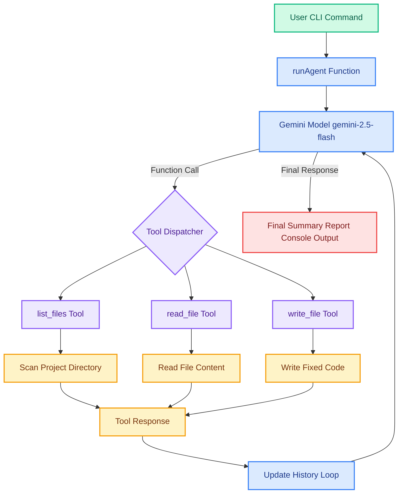

## 🎨 High-Level Architecture Diagram

### 🚀 Architecture Type

Autonomous AI Agent with Tool Calling  
Pattern Used: Reason → Act → Observe → Refine

The agent:
- Scans files
- Reads content
- Fixes bugs & security issues
- Writes corrected code
- Generates structured review report
